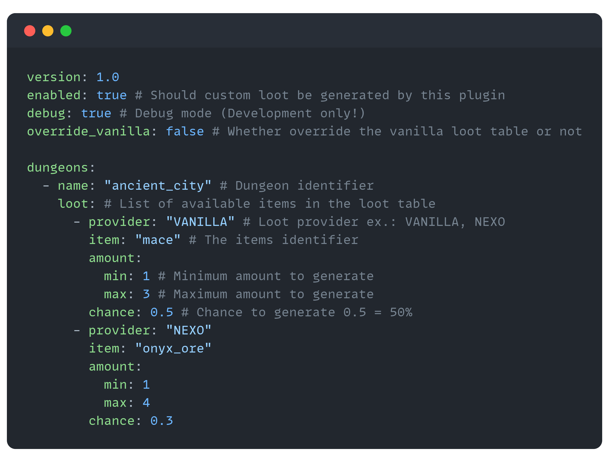

# Yet Another Loot Manager

---

  
   
  <h3>🎯 Take control of your server's loot with easy customization! Support for Nexo included. 🚀</h3>
  <h4>*ItemsAdder coming soon*</h4>

  
   
  <h3>💥 Control what your players get from trial chambers! 🗝️</h3>

---

## 🛠️ Config File Made Easy

  
  <h3>🔧 Effortlessly configure and customize to suit your needs!</h3>
  
<i>* Example: Structure loot config file *</i>

---

## 📦 Modules
**Yet Another Loot Manager** currently has the following sub-parts:

- **Structure Loot** – Customize loot found in various generated structures.
- **Trial Chambers** – Control rewards players receive from trial chambers.

*🚧 Upcoming Modules*:

- **Archaeology** – Manage loot from dig sites and excavation mechanics.
- **Villager** – Adjust villager trades to your liking.
- **Piglin** – Fine-tune Piglin bartering.

---

## 🤝 Contribution

We welcome contributions to **Yet Another Loot Manager**! Here's how you can get involved:
1. Fork the repository and create a new branch for your feature or bugfix.
2. Submit a pull request describing your changes.

Please ensure your code includes proper documentation. Feedback and feature suggestions are also welcome in the Issues section!

---

## 📂 My Other Projects

Check out some of my other work:
- [**Bartering manager**](https://github.com/Levy-Y/bartering-manager) - Easily modify the loot of piglin bartering.
- [**Morph potion**](https://github.com/Levy-Y/MorphPotion) - Transform into an animal by drinking a potion.

Explore my GitHub profile for more: [**Levy-Y**](https://github.com/Levy-Y)

---

## ⚖️ Legal

**Yet Another Loot Manager** is licensed under the [MIT License](https://opensource.org/licenses/MIT).

This project is not affiliated with or endorsed by Nexo or ItemsAdder. All trademarks referenced are the property of their respective owners.

---
